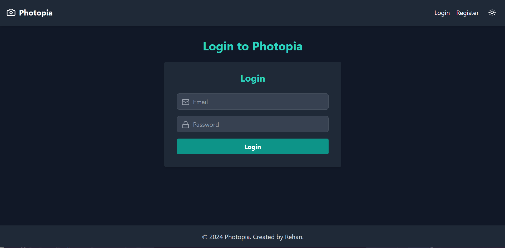
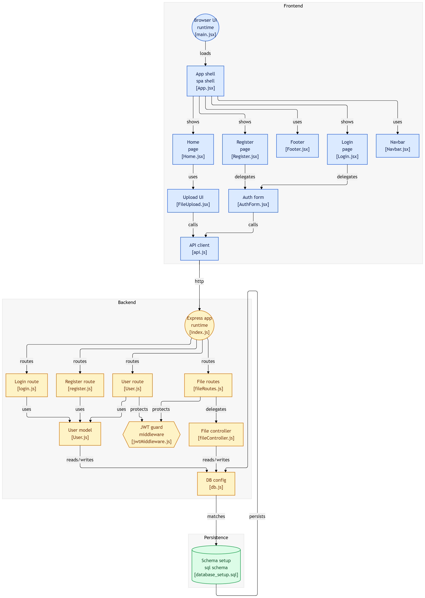

# 📸 Photopia

[](https://photopia-one.vercel.app)
[](#)
[](#)
[](#)
[](LICENSE)

> **"Capture memories. Organize effortlessly."**

Photopia is a full-stack photo storage platform that allows users to securely upload, manage, and organize personal images through a modern web interface powered by React, Express, MySQL, and JWT authentication.

---

## 🌐 Live Demo

**Frontend:** https://photopia-one.vercel.app

> **Note**
>
> The frontend is publicly available on Vercel. Backend services are intended for local development.

---

# 📖 About

Photopia is a personal full-stack project focused on secure image management.

Users can register, authenticate, upload images, and access their personal media through a clean and responsive interface. The project demonstrates secure authentication, protected API routes, file uploads, and relational database management using MySQL.

---

# ✨ Features

### 👤 Authentication

* User Registration
* Secure Login
* JWT Authentication
* Protected Routes
* Password Management

### 📸 Media Management

* Upload Images
* Personal Gallery
* User-specific Storage
* Secure File Access

### 🎨 User Experience

* Responsive Design
* Clean Interface
* Dark Mode
* Mobile Friendly

### 🔒 Security

* JWT Authentication
* Protected API Endpoints
* Password Hashing
* Authorization Middleware

---

# 🖥️ User Interface

Photopia provides a minimal and responsive interface designed to make uploading and managing photos simple across desktop and mobile devices.

> Replace the image below with your latest application screenshot.

```html
<p align="center">
  
</p>
```

---

# 🏗️ System Architecture

The project follows a traditional client-server architecture with clear separation between presentation, business logic, authentication, and data persistence.

```html
<p align="center">
  
</p>
```

### Architecture Overview

```text
Browser
   │
React + Vite
(Client)
   │
Axios
   │
Express API
   │
JWT Middleware
   │
Controllers
   │
MySQL Database
```

### Components

**Client**

* React
* React Router
* Axios
* Tailwind CSS

**Backend**

* Express.js
* JWT Authentication
* File Upload Controller
* User Management

**Database**

* MySQL
* Users
* Uploaded Files

---

# 🛠️ Technology Stack

| Category       | Technology                |
| -------------- | ------------------------- |
| Frontend       | React, Vite, Tailwind CSS |
| Backend        | Node.js, Express.js       |
| Database       | MySQL                     |
| Authentication | JWT                       |
| HTTP Client    | Axios                     |
| Deployment     | Vercel                    |

---

# 📂 Project Structure

```text
photopia/
│
├── backend/
│   ├── config/
│   ├── controllers/
│   ├── models/
│   ├── routes/
│   ├── database_setup.sql
│   ├── index.js
│   └── package.json
│
├── client/
│   ├── public/
│   │   ├── logo.png
│   │   ├── ui.png
│   │   └── diagram.png
│   │
│   ├── src/
│   │   ├── components/
│   │   ├── pages/
│   │   ├── utils/
│   │   ├── App.jsx
│   │   └── main.jsx
│   │
│   ├── package.json
│   └── vite.config.js
│
├── LICENSE
└── README.md
```

---

# 🚀 Getting Started

## Prerequisites

* Node.js 18+
* MySQL Server

---

## Clone Repository

```bash
git clone https://github.com/rsayyed591/photopia.git

cd photopia
```

---

## Database Setup

Run the SQL script located in:

```text
backend/database_setup.sql
```

This creates the required database tables for authentication and file management.

---

## Backend Setup

```bash
cd backend

npm install
```

Create a `.env` file.

```env
JWT_SECRET=your_secret_key

DB_HOST=localhost

DB_USER=root

DB_PASSWORD=your_password

DB_NAME=user_auth_system
```

Run the server.

```bash
npm start
```

---

## Frontend Setup

```bash
cd client

npm install
```

Create a `.env` file.

```env
VITE_API_URL=http://localhost:5000
```

Run the development server.

```bash
npm run dev
```

---

# ⚙️ Environment Variables

### Backend

```env
JWT_SECRET=
DB_HOST=
DB_USER=
DB_PASSWORD=
DB_NAME=
```

### Client

```env
VITE_API_URL=http://localhost:5000
```

---

# 🔐 API Endpoints

### Authentication

| Method | Endpoint               |
| ------ | ---------------------- |
| POST   | `/api/register`        |
| POST   | `/api/login`           |
| POST   | `/api/change-password` |

### Files

| Method | Endpoint      |
| ------ | ------------- |
| POST   | `/api/upload` |
| GET    | `/api/files`  |

---

# 💡 Roadmap

* [ ] Cloud Storage (Cloudinary / AWS S3)
* [ ] Album Management
* [ ] Image Search
* [ ] Drag & Drop Uploads
* [ ] Image Compression
* [ ] Shareable Links
* [ ] Profile Settings
* [ ] Docker Support

---

# 🤝 Contributing

Contributions are welcome.

1. Fork the repository.

2. Create a feature branch.

```bash
git checkout -b feature/amazing-feature
```

3. Commit your changes.

```bash
git commit -m "feat: add amazing feature"
```

4. Push your changes.

```bash
git push origin feature/amazing-feature
```

5. Open a Pull Request.

---

# 👨‍💻 Author

**Rehan Sayyed**

* 🌐 Portfolio: https://iamrehan.dev
* GitHub: https://github.com/rsayyed591
* LinkedIn: https://linkedin.com/in/rehan42

---

# 📄 License

This project is licensed under the **MIT License**.

See the [LICENSE](LICENSE) file for more information.

---

<div align="center">

### ⭐ Enjoying Photopia?

If you found this project useful, consider giving it a **star**.

Made with ❤️ by **Rehan Sayyed**

</div>
